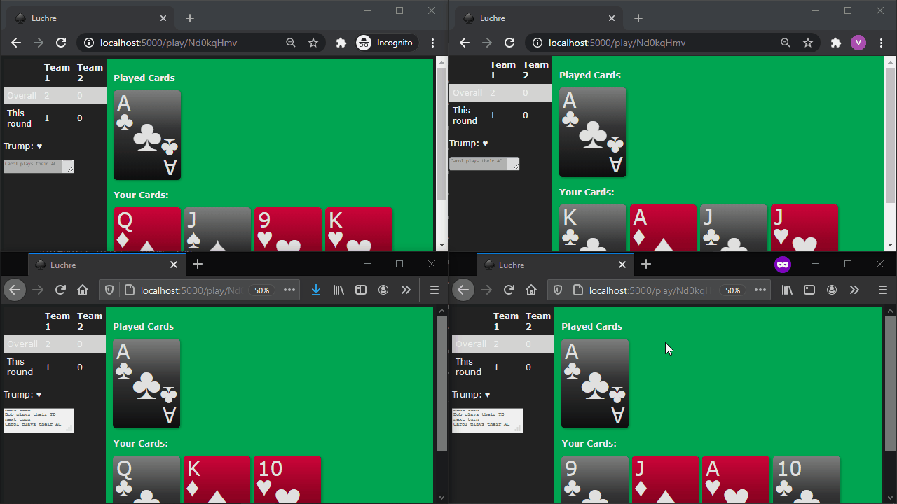

# Farmers Market Finder

This is a web app I made in 2017 to play Euchre.

## Demo

## Run Project Locally

This project requires a Python installation. To run the project locally:

* Run `pip install -r requirements.txt` to install all the dependencies.
* Run `python main.py` to start the server.
* Navigate to `localhost:5000` in a web browser.

## Technologies Used
* Python
  * Flask
    * Flask-SQLAlchemy
    * Flask-SocketIO
* JavaScript
    * jQuery
    * Socket.IO
* CSS
    * Sass
## License

The code in this project is licensed under the MIT License.